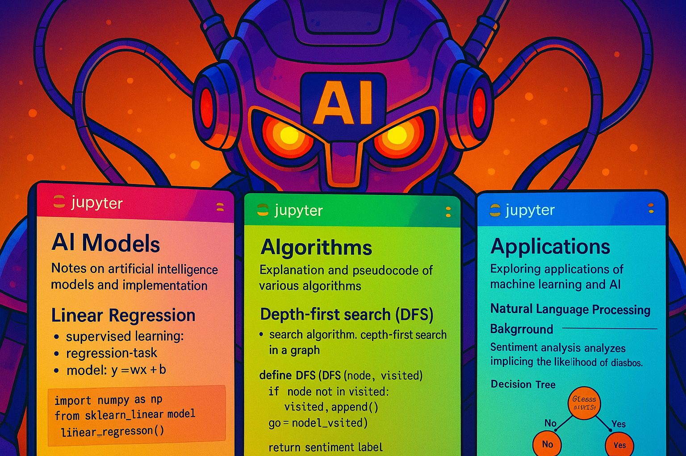

# AI notebooks

Some jupyter notebooks containing notes and implementation of AI models, algorithms, & applications. 

Or generally stuff I try to learn. Adding AI slop for good measure:



## venv

The venv used to run the notebooks can be re-created easily using [uv](https://docs.astral.sh/uv/getting-started/installation/):

```bash
uv venv  # python version in pyproject.toml, else use --python=3.{x} to specify
uv sync
```

**NOTE:** You may have to add the venv as Jupyter kernel. But in VSCode it should be detected immediately.

## the notebooks

Best to view the notebooks locally using VSCode or JupyterLab.
The notebooks for each topic can be found in separate folders in the root directory:

| **Topic** | **Path** | **Primary Reference(s)** |
| :-- | :-- | :-- |
| Deep Learning Systems | `/dlsys` | [CMU 10-414/714: Deep Learning Systems](https://dlsyscourse.org/lectures/). Fall 2024 + 2022 lecture recordings | 
